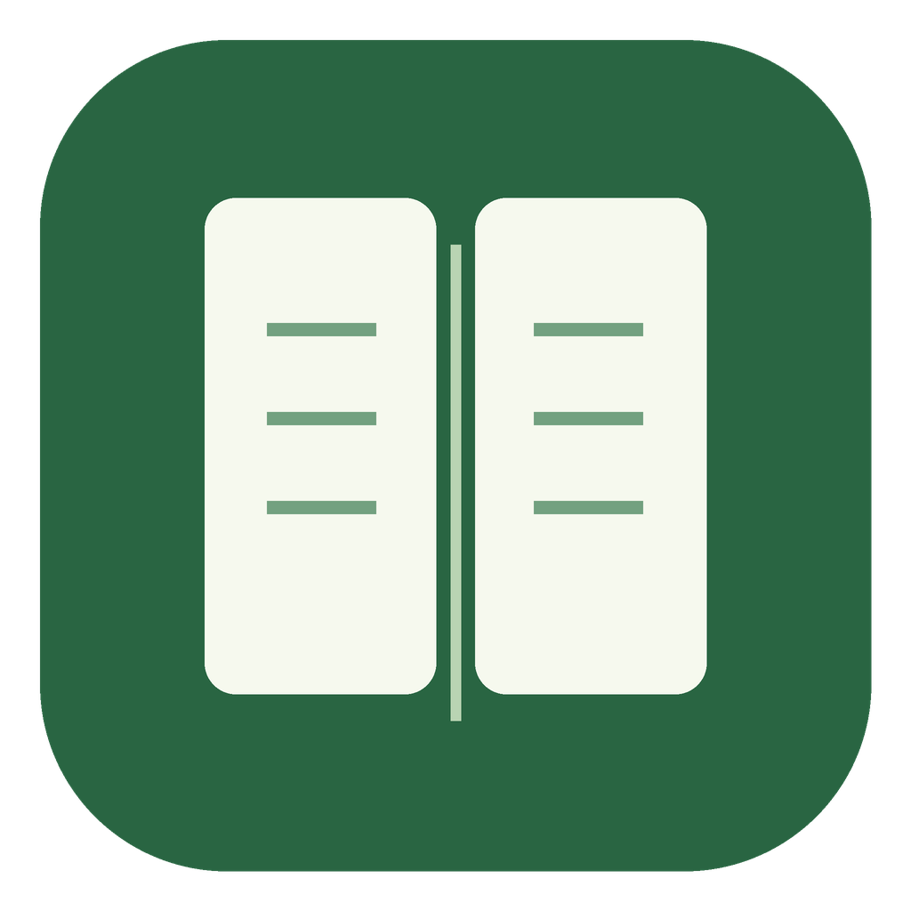

<p align="center">
  
</p>
<h1 align="center">Folio</h1>
<p align="center"><strong>Your papers. Your notes. Your next manuscript.</strong></p>
<p align="center">A free, local-first reference manager for reading papers and writing manuscripts.</p>
<p align="center">
  <a href="docs/install.md"><strong>Get started</strong></a> ·
  <a href="https://hongxiang2023.github.io/folio/demo/">Try the demo</a> ·
  <a href="docs/user-guide.md">User guide</a>
</p>

## Download Folio

### Mac with Apple silicon · macOS 13 or newer

**[Download Folio for Mac · Apple silicon (.dmg)](https://github.com/Hongxiang2023/folio/releases/download/v0.1.0-preview.1/Folio-0.1.0-arm64.dmg)**

No Node.js or terminal is needed.

1. Open the downloaded `.dmg` file.
2. Drag **Folio** into **Applications**.
3. Open **Folio** from Applications. On later visits, open it like any other Mac app.

**Early preview:** this build is not Apple-notarized or Developer ID-signed, so macOS may block its first launch. Only if you trust this download, follow [the first-launch instructions](docs/install.md#if-macos-blocks-the-first-launch) using **System Settings → Privacy & Security → Open Anyway**. Keep normal macOS security protections enabled.

Not sure which Mac you have? **Apple menu → About This Mac** lists an Apple M-series **Chip** on Apple silicon. An Intel **Processor** needs the source setup below. [Check your Mac and install →](docs/install.md#macos)

| Your computer or goal | Start here |
| --- | --- |
| Mac with Apple silicon | [Download the Mac app](https://github.com/Hongxiang2023/folio/releases/download/v0.1.0-preview.1/Folio-0.1.0-arm64.dmg) · [Installation help](docs/install.md#macos) |
| Intel Mac, Windows, or Linux | [Run from source](docs/install.md#source-installation) — Node.js required; installers not provided yet |
| Explore without installing | [Try the interactive demo](https://hongxiang2023.github.io/folio/demo/) — an illustration, not the app |
| Practice with fictional papers | [Follow the hands-on demo](docs/demo.md) |

<details>
<summary><strong>Source setup in two commands</strong></summary>

Install [Node.js LTS](https://nodejs.org/en/download) (22.13 or newer). [Download the source ZIP](https://github.com/Hongxiang2023/folio/archive/refs/heads/main.zip), extract it, and open a terminal in the folder containing `package.json`:

```sh
npm ci
npm run desktop
```

This source ZIP is project code, not the Mac app installer. [Step-by-step instructions for each system →](docs/install.md#source-installation)

</details>

## A home for the whole reading workflow

| Collect & organize | Read & understand | Write & revise |
| --- | --- | --- |
| Import PDFs and RIS/Folio references | Original PDF and optional reading view | PMID, DOI, arXiv, and local citation markers |
| Look up PMID, DOI, or arXiv metadata | Text, figures, legends, and source-page links | APA, Nature, Vancouver, IEEE, and more CSL styles |
| Save pages with the Chrome/Edge connector | Notes, highlights, and figure zoom | Word upload, formatted export, and revised bibliography |
| Collections, tags, stars, reading status | Optional paper chat using your AI provider | BibTeX copy and full library backups |

No Folio account or subscription is needed for core features. Your references, PDFs, notes, and highlights stay on your computer. Public identifier lookup and optional AI use external services only for their respective tasks; AI requires your own connection and explicit per-paper enablement.

## Just type the PMID

Write one reference or several at the same location:

```text
One source (36599988).
Several sources (36599988, 40903587).
```

Choose **Generate references**, paste your text or upload Word, select a style, and review the result. Missing public identifiers can be looked up automatically. No `PMID:` prefix is needed for these modern IDs.

**No PubMed ID?** Use a DOI, arXiv ID, or **Copy citation marker** from a saved reference:

```text
A DOI source (doi:10.1038/nphys1170).
An arXiv source (arxiv:1706.03762).
A mixed group (PMID: 36599988; doi:10.1038/nphys1170).
```

These are syntax examples, not scientific claims. Short PMIDs need an explicit prefix, such as `(PMID: 12345)`; ordinary years and formatted citation numbers are left alone.

**During revision:** edit the exported Word file, add new markers outside existing citation controls, and upload it again. Folio refreshes the citations and replaces its reference list. Preserve those controls; to change a citation's sources, replace the whole control with a new marker. [Citation and revision guide →](docs/user-guide.md#generate-and-revise-manuscript-references)

## Keep the original within reach

Open **Read PDF → Reading view** for locally extracted text and figures, section navigation, notes, and highlights. Use **Check original** whenever a passage needs verification. Reading caches work offline and can be removed without deleting the PDF or notes.

Rules cover several Nature-family layouts, Cell Reports, Science Advances, and common article layouts. Extraction remains imperfect for some tables, mathematics, scans, and unusual PDFs; the original stays available. [Reading guide →](docs/user-guide.md#read-pdfs-and-create-reading-views)

## Learn more

[Installation & troubleshooting](docs/install.md) · [Complete user guide](docs/user-guide.md) · [Browser connector](docs/user-guide.md#save-papers-with-the-browser-connector) · [Backup & restore](docs/user-guide.md#back-up-restore-and-move-your-library) · [Optional AI](docs/user-guide.md#ask-a-paper-with-optional-ai)

Folio is an independent early-preview project. It currently has no cloud sync, shared libraries, OCR, or live Word/Google Docs add-in. Review metadata and generated references before submission. Automated source checks cover macOS, Windows, and Linux; the downloadable preview currently targets Apple silicon Macs only.

<details>
<summary><strong>For developers and contributors</strong></summary>

```sh
npm run check          # build, typecheck, and automated tests
npm run dist:desktop   # package locally; does not publish
```

For browser mode, run `npm run build` and `npm start`, then open `http://127.0.0.1:47821/papers`. Stop desktop mode first. For frontend development, keep the local service running and use `npm run dev` in a second terminal.

Report problems with your OS, Folio version, reproduction steps, and error message. Prefer synthetic examples over private papers or manuscripts. Never share your library folder or credentials.

[Release checklist](RELEASE.md) · [Security](SECURITY.md) · [Citation-style notices](CSL-NOTICES.md)

</details>

Source is [MIT-licensed](LICENSE). Dependencies and citation styles retain their own licenses.
